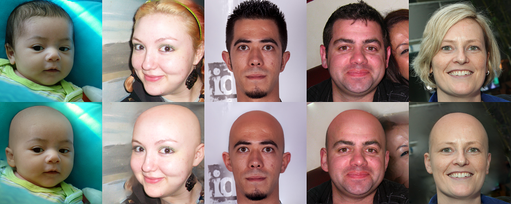

# non-hair-FFHQ
Non-hair-FFHQ dataset  is a high-quality image dataset that contains 6,000 non-hair FFHQ portraits, based on [ stylegan2-ada](https://github.com/NVlabs/stylegan2-ada-pytorch) and [ffhq-dataset](https://github.com/NVlabs/ffhq-dataset).

The dataset is built by our HairMapper method.

> **HairMapper: Removing Hair from Portraits Using GANs** 
> [Yiqian Wu](https://onethousandwu.com/), [Yongliang Yang](http://www.yongliangyang.net/), [Xiaogang Jin](http://www.cad.zju.edu.cn/home/jin)*. 2022 IEEE/CVF Conference on Computer Vision and Pattern Recognition.

[Paper]( )    [Video]( )    [Project Page]()

We apply our method on FFHQ images (All images have licenses that allow **free use, redistribution, and adaptation for non-commercial purposes**) and present a [non-hair-FFHQ](https://github.com/oneThousand1000/non-hair-FFHQ) dataset that contains 6,000 non-hair portraits to inspire and facilitate more works in the future.

## Overview

Google drive link of the dataset will be released soon.

| dir          | information                     |
| ------------ | ------------------------------- |
| ├ [origin]() | origin images, `{img_id}.png`   |
| └ [res]()    | results images , `{img_id}.png` |

## Agreement

The non-hair-FFHQ dataset is available for **non-commercial research purposes** only.

## Related Works

> **A Style-Based Generator Architecture for Generative Adversarial Networks**
> Tero Karras (NVIDIA), Samuli Laine (NVIDIA), Timo Aila (NVIDIA)
> https://arxiv.org/abs/1812.04948

> **Training Generative Adversarial Networks with Limited Data**
> Tero Karras, Miika Aittala, Janne Hellsten, Samuli Laine, Jaakko Lehtinen, Timo Aila
> https://arxiv.org/abs/2006.06676

## Citation

Coming soon.

## Contact

[jin@cad.zju.edu.cn](mailto:jin@cad.zju.edu.cn)

onethousand@zju.edu.cn

onethousand1250@gmail.com

